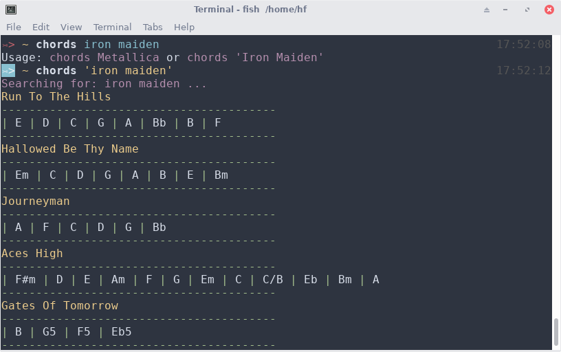
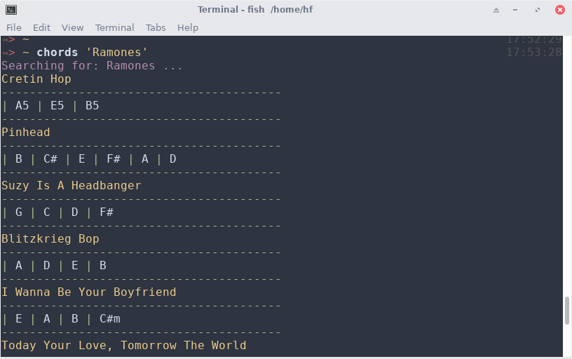

# cli-chords

A CLI app to get chords from [Songsterr public API](https://www.songsterr.com/a/wa/api/).

### Install and usage

```console
$ npm i cli-chords -g
$ chords --artist foobar
```

### Previous way usage before migrate to TypeScript:






